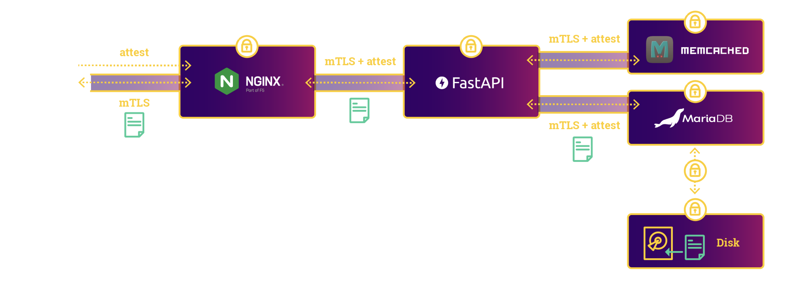
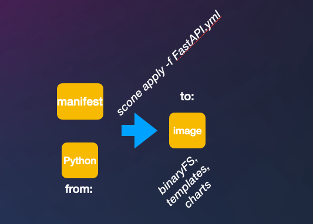

# Confidential Document Manager Application

This application demo is a confidential document web application. This service enables users to upload and download documents and ensures that the documents are always encrypted. Users can create accounts. We use a simple password-based authentication. For production, one should add a two-factor authentication. The application  consists of the following components:

- a **Python FastAPI** service serving as the application's REST API,
- a **MariaDB** service stores the documents and user authentication data,
- a **memcached** service, serving as a rate limiter for the application, and
- an **nginx** instance serves as a proxy server for the application, ensuring termination and forwarding with TLS.



All of these components run securely inside of enclaves using the SCONE framework. These services are also integrity protected, and attest each other transparently using TLS in conjunction with a SCONE Configuration and Attestation Service (CAS). Furthermore, the application protects the confidentiality and integrity of all data it receives. We deploy this application using `helm`.

## Building und Running the Application



You can get this program to run in 4 steps:

```bash
sconectl apply -f FastApi.yml   # generates a custom FastAPI container image
sconectl apply -f Meshfile.yml  # generates/uploads the policies and helm charts
```

## Deploying the application 

The application can be deployed with help as follows:

```bash
helm install secure-doc-management target/helm
```

We put these steps in script `run.sh`, i.e., you could also just execute `run.sh`.

If you want to enable persistence for MariaDB, create volume claims as follows:

```bash
# The volume claims use the nfs-client storage class.
# If you want to use a different one, running on azure for example,
# change the storage class before applying the volume claims. 
kubectl apply -f volume-claims/maria-pvc.yml
```

Then, after creating the volume claims, deploy the application with the following:

```bash
helm install secure-doc-management target/helm \
    --set mariadb-scone.persistence.enabled=true \
    --set mariadb-scone.persistence.existingClaim=maria-data-pvc \
    --set mariadb-scone.persistence.size=1Gi \
    --set mariadb-scone.extraVolumes\[0\].name=external \
    --set mariadb-scone.extraVolumes\[0\].persistentVolumeClaim.claimName=maria-external-pvc \
    --set mariadb-scone.extraVolumes\[1\].name=vartmp \
    --set mariadb-scone.extraVolumes\[1\].persistentVolumeClaim.claimName=maria-vartmp-pvc \
    --set mariadb-scone.extraVolumeMounts\[0\].name=external \
    --set mariadb-scone.extraVolumeMounts\[0\].mountPath=/external \
    --set mariadb-scone.extraVolumeMounts\[1\].name=vartmp \
    --set mariadb-scone.extraVolumeMounts\[1\].mountPath=/var/tmp
```

## Running the Client

..to do...
