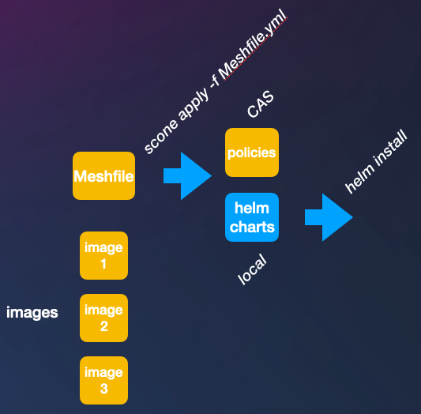

# Confidential Document Manager Application

This application demo is a confidential document web application. This service enables users to upload and download documents and ensures that the documents are always encrypted. Users can create accounts. We use a simple password-based authentication. For production, one should add a two-factor authentication. The application  consists of the following components:

- a **Python FastAPI** service serving as the application's REST API,
- a **MariaDB** service stores the documents and user authentication data,
- a **memcached** service, serving as a rate limiter for the application, and
- an **nginx** instance serves as a proxy server for the application, ensuring termination and forwarding with TLS.

All of these components run securely inside of enclaves using the SCONE framework. These services are also integrity protected, and attest each other transparently using TLS in conjunction with a SCONE Configuration and Attestation Service (CAS). Furthermore, the application protects the confidentiality and integrity of all data it receives. We deploy this application using `helm`.

## Running the Application


You can get this program to run in 4 steps:

```bash
# build the application by building images and using custom images 
scone apply -f FastApi.yml   # generates a custom FastAPI image
scone apply -f Meshfile.yml  # generates and uploads the policies and writes the helm charts

# deploy the application
kubectl create namespace SecureDocuments # ensure that we have the right name
helm install --namespace SecureDocuments secure-doc-management # use helm chart to install
```



We put these steps in script `run.sh`, i.e., you could also just execute `run.sh`.

## Running the Client

..to do...